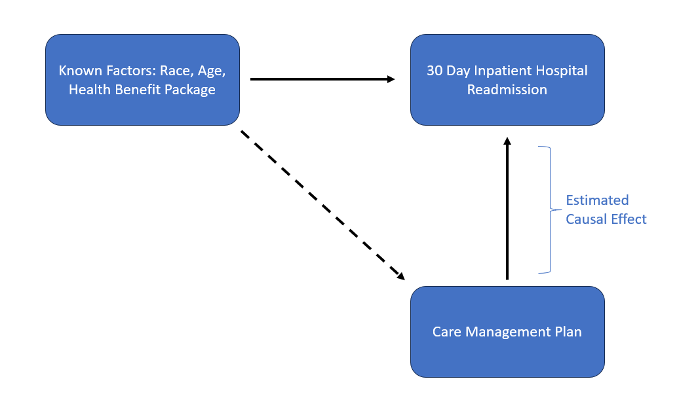
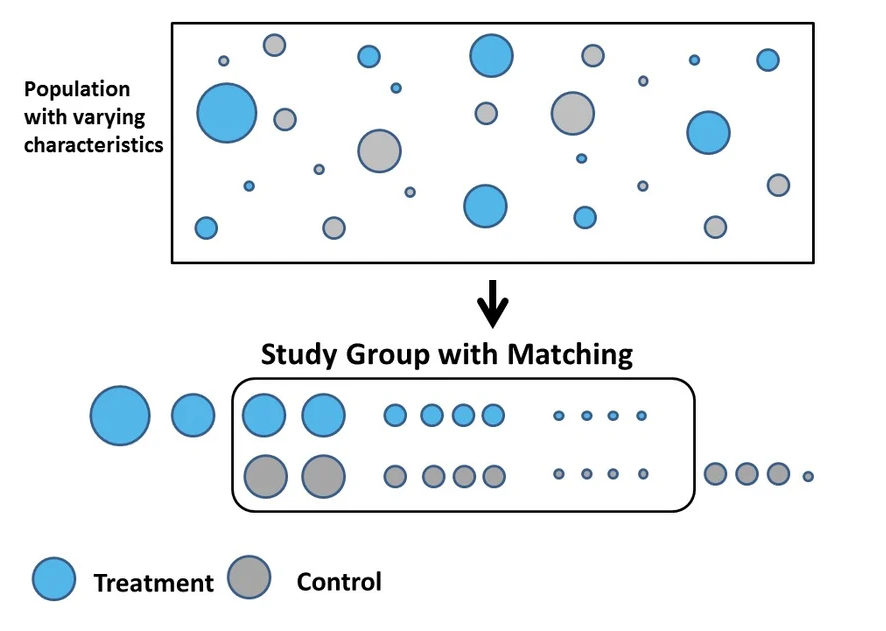

### Why are Program Evaluations done?
Program Evaluations of Care Management programs allow us to assess what would have happened if a member who was qualified for a program was not enrolled in the program.

### Program Evaluation Framework
The program evaluation for the study population is done through a casual inference modeling framework. Upon compiling data on the study population, propensity score matching is to be used to create a matched dataset with an artificial control group. Using the matched dataset survival analysis is performed by fitting cox proportional hazard models to determine hazard ratios for our outcome and additional factors, survival curves were fit to display proportion of patients without a readmission. 

### Important Terminology

Causal Inference: 
Causal Inference refers to the process of determining whether an observed association truly reflects a cause and effect relationship.

  

Propensity Score Matching:
Propensity Score Matching is a statistical technique to construct an artificial control group by matching each treated unit with a non-treated unit of similar characteristics.

  
Source: https://www.summitllc.us/propensity-score-matching

Cox Proportional Hazards Models:
The purpose of the model is to evaluate simultaneously the effect of several factors on survival. In the context of our problem, the model allows us to examine how specific factors influence the rate of readmission. 

Hazard Ratios:
The probability of an event in the treatment group relative to the control group probability over a unit of time.
* HR = 1: No Effect
* HR < 1: Reduction in Hazard
* HR > 1: Increase in Hazard

### Data Science Methodology Used

* Construct Dataset of eligible study population using numerous SQL queries to pull medical claims and demographic information. 

* Perform propensity score matching to create matched dataset, matching on factors that are of interest to our outcome variable of readmission. Use literature review and characteristics of study population to determine factors that need to be matched on. Use techniques such as optimal full and exact matching for certain factors.

* Fit Cox Proportional Hazards Models and Survival Curves, Analyze Results, Conclude Business Impact.

#### Data Science Technologies Used 

* Programming Languages: Python, R (Matchit library), SQL
* Source-Code Editor: Microsoft Visual Studio Code
* Cloud-Computing: AWS, S3
* Github Enterprise